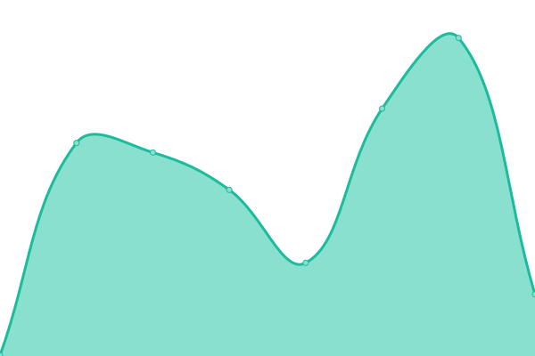
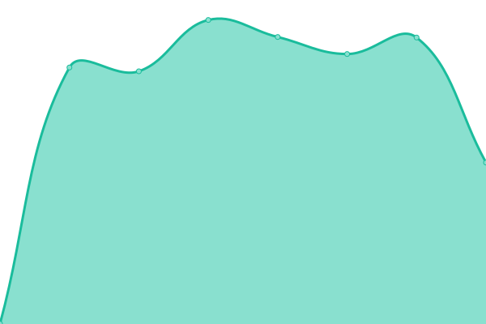

# [📈 Live Status](https://olivierdelomez.github.io/monitoring3d): <!--live status--> **🟩 All systems operational**

This repository contains the open-source uptime monitor and status page for [Olivier Delomez](https://olivierdelomez.github.io/monitoring3d), powered by [Upptime](https://github.com/upptime/upptime).

With [Upptime](https://upptime.js.org), you can get your own unlimited and free uptime monitor and status page, powered entirely by a GitHub repository. We use [Issues](https://github.com/olivierdelomez/monitoring3d/issues) as incident reports, [Actions](https://github.com/olivierdelomez/monitoring3d/actions) as uptime monitors, and [Pages](https://olivierdelomez.github.io/monitoring3d) for the status page.

<!--start: status pages-->
<!-- This summary is generated by Upptime (https://github.com/upptime/upptime) -->
<!-- Do not edit this manually, your changes will be overwritten -->
<!-- prettier-ignore -->
| URL | Status | History | Response Time | Uptime |
| --- | ------ | ------- | ------------- | ------ |
|  [Dento](https://dento.3dcelo.com/#/) | 🟩 Up | [dento.yml](https://github.com/olivierdelomez/monitoring3d/commits/HEAD/history/dento.yml) | 

 396ms
     
 | 

<a href="https://olivierdelomez.github.io/monitoring3d/history/dento">100.00%</a>
    

|  [3Dcelo](https://www.3dcelo.com) | 🟩 Up | [3-dcelo.yml](https://github.com/olivierdelomez/monitoring3d/commits/HEAD/history/3-dcelo.yml) | 

 971ms
     
 | 

<a href="https://olivierdelomez.github.io/monitoring3d/history/3-dcelo">100.00%</a>
    

|  [Duchesse](https://duchesse-aligners.com) | 🟩 Up | [duchesse.yml](https://github.com/olivierdelomez/monitoring3d/commits/HEAD/history/duchesse.yml) | 

 1032ms
     
 | 

<a href="https://olivierdelomez.github.io/monitoring3d/history/duchesse">100.00%</a>
    

<!--end: status pages-->

[**Visit our status website →**](https://olivierdelomez.github.io/monitoring3d)

## 📄 License

- Powered by: [Upptime](https://github.com/upptime/upptime)
- Code: [MIT](./LICENSE) © [Olivier Delomez](https://olivierdelomez.github.io/monitoring3d)
- Data in the `./history` directory: [Open Database License](https://opendatacommons.org/licenses/odbl/1-0/)
